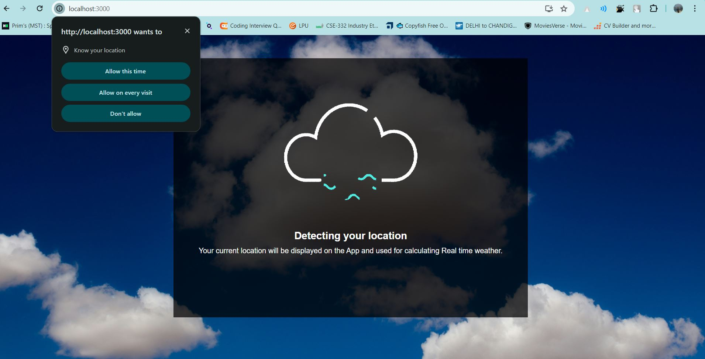
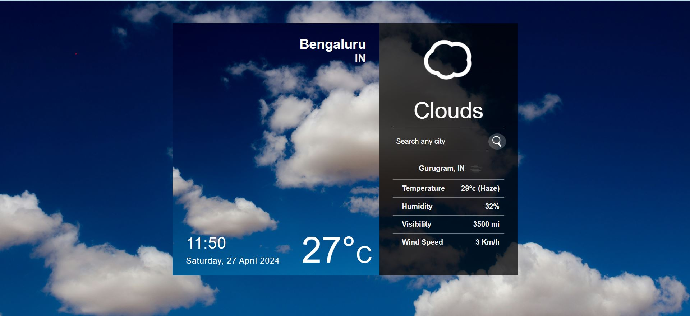

# Weather Dashboard Application

This Weather Dashboard Application (named as Weather wizard) is a web-based tool designed to provide users with up-to-date weather information for their desired locations. It allows users to search for a specific city or location and view current weather conditions like temperature, humidity, wind speed etc.

## Features

- Geolocation - Incorporating the geolocation feature in our React project enhances user experience by automatically detecting and displaying location-specific content.
- Current Weather - View the current weather conditions including temperature, humidity, wind speed, and weather description.
- Search Functionality - Easily search for weather information like temperature, wind speed and humidity by entering the name of a city or location.
- Responsive Design - The application is designed to be responsive and accessible across various devices and screen sizes.

## Technologies Used

- HTML5: Used for structuring the web pages.
- CSS3: Used for styling the user interface and making the application visually appealing.
- React Js: Efficient and flexible way of building user interfaces for web applications. Its component-based architecture allows developers to create reusable and modular UI elements, making it easier to manage complex user interfaces
- OpenWeatherMap API: OpenWeatherMap is an online service, owned by OpenWeather Ltd, that provides global weather data via API, including current weather data, forecasts, nowcasts, and historical weather data. The company provides a minute-by-minute hyperlocal precipitation forecast. It is Used to retrieve weather data for cities and locations.
- Git: Version control system for tracking changes and collaborating with team members.

## Setup Instructions

- First, you need to download the code or clone this repository into a specific folder on your system.
- After that, you need to run 'npm install' in that cloned folder  in order to ensure that all the necessary libraries or dependencies are installed properly.
- Before running the application, you need to create an account on OpenWeatherMap and generate your own API key. Once you have the API key, you need to paste it into the 'apikey.js' file. This step is crucial for the project as without the API key, the application will not be able to make API calls. 
- After that run 'npm start' in that folder and this weather dashboard application will run.

## Usage/Examples

After the setup is done properly, you can run this weather dashboard application. In the user interface, you will first be prompted to grant location permission. Once permission is granted, the application will detect your current location; otherwise, it will use some random coordinates (acc. to code).

After granting location permission, you will be able to view the current weather condition based on your location. If you wish to search for a specific city, enter the name of the city in the search bar, and you will then be able to see the weather conditions for that city.

## Contributing

Contributions are welcome! If you'd like to contribute to the project, please follow these steps:

- Fork the repository.
- Create a new branch (git checkout -b feature/improvement).
- Make your changes.
- Commit your changes (git commit -am 'Add new feature').
- Push to the branch (git push origin feature/improvement).
- Create a new Pull Request

